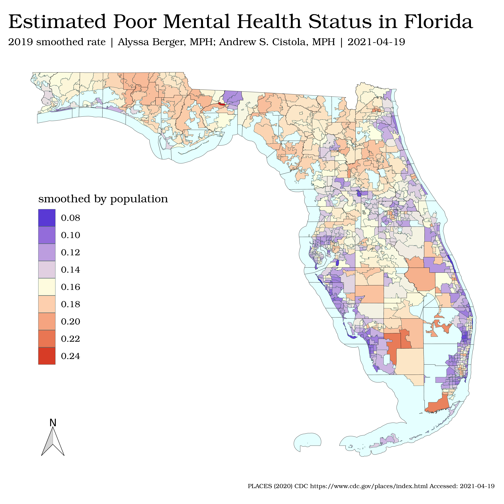

# PHC 6194 - Spatial Epidemiology
PHC 6194 - Spatial Epidemiology (Spring 2021) 
 
 
 
## About this Repository
This repository contains student work completed for PHC 6194 Spatial Epidemiology taken in Spring of 2021 from Dr. Hui Hu (https://www.hui-hu.com) at the University of Florida. Course content is pulled from `https://github.com/benhhu/PHC6194SPR2021` and stored with completed assignments in this repoistory. Visibility of the repo is private to protect unauthorized dissemination of course content.

## Directory
`CLASS` Mirror of class content in `https://github.com/benhhu/PHC6194SPR2021` with assignment submissions added 
`FINAL` directory containing files used for final project in collaboration with `https://github.com/alyssaberger`
`_code` Code scripts not connected to assignments, labs, or projects 
`_data` Data files taken from https://github.com/andrewcistola/healthy-neighborhoods.git for use in final project 
`LICENSE` Generic MIT licenses for open source projects from DrewC! 
`.gitattributes` File extensions marked for GH large file storage 
`README.md` Description, directory, notes 

### Variable Names:
Python and R code scripts use the following variable naming conventions: 
`xx` 2-6 letter abbrevation based on content within data object 
`df_xx` Pandas and R dataframes 
`l_xx` Pandas and R lists 
`v_xx` R vectors 
`a_xx` Numpy arrays 
`m_xx` Numpy or R matrices 
`p_xx` Matplotlib, ggplot, or R plots 
Modles created with various methods are assigned informaitve short names: 
`lin_xx`, `log_xx`, `forest_xx`, `rfe_xx`, `pca_xx` 
Tables with features and targets used for modeling utilize standard names: 
`df_X`, `df_Y`, `df_XY` 
When using numbers, two digits are used by default (ex. `df_01`)

### PEP-8 Standards:
Whenever possible code scripts follow PEP-8 standards 
Wihtin these standards, scripts use the following elective options: 
`=` for variable defintions (no `<-`) 
`''` for all character strings or arguments (no `""`)  
Arguments in a function are suuplied by name, rather than position (ex. `ggplot(data = df_XY, aes(x = ColX, y = ColY)`) 
A single space is provided between each element (ex. `columns = 'ColA'`) 

## Disclaimer
While the author (Andrew Cistola) is a Florida DOH employee and a University of Florida PhD student, these are NOT official publications by the Florida DOH, the University of Florida, or any other agency. All information in this repository is available for public review and dissemination but is not to be used for making medical decisions. All code and data inside this repository is available for open source use per the terms of the included license.